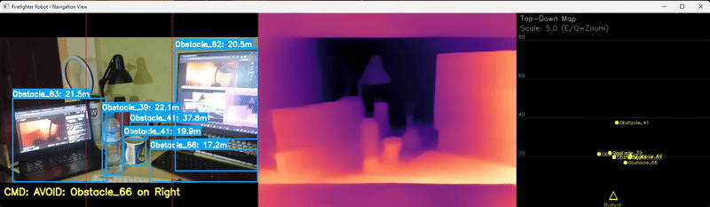

# Firebot - Depth-Aware Firefighting Robots

This project features an experimental machine learning system that equips robots with depth perception for autonomous firefighting. It integrates YOLOv8 for real-time fire detection, dense vision transformers for depth estimation, and autonomous navigation to effectively respond to incidents.



## Architecture Overview

The system architecture consists of several key components:

1. **Vision System**
   - Primary YOLOv8 model for fire/smoke detection
   - Secondary YOLOv8 model for depth estimation
   - Depth-aware navigation system
   - Real-time image processing pipeline

2. **Control System**
   - Autonomous navigation algorithms
   - Motor control interface
   - Sensor fusion system

3. **Backend Integration**
   - Firebase Realtime Database for data logging
   - Remote monitoring capabilities
   - Real-time alert system


## Technology Stack

### YOLOv8
- [Ultralytics YOLOv8 Documentation](https://docs.ultralytics.com/)
- Used for object detection and depth estimation
- Custom fine-tuned model for fire/smoke detection

### Dense Vision Transformers
- [Dense Vision Transformer Paper](https://arxiv.org/abs/2203.09887)
- Used for enhanced depth perception
- Integration with YOLOv8 for improved accuracy

### Firebase
- Real-time database for logging and monitoring
- Alert system integration
- Remote control capabilities

## How It Works

The system runs two YOLOv8 models in parallel:

1. **Fire Detection Model**
   - Processes input frames for fire/smoke detection
   - Provides bounding boxes and confidence scores
   - Triggers alerts when fire is detected

2. **Depth Estimation Model**
   - Processes the same frames for depth information
   - Provides depth maps for navigation
   - Helps in obstacle avoidance

The models work together to:
- Detect fire incidents
- Calculate safe navigation paths
- Avoid obstacles
- Log data to Firebase
- Send real-time alerts


## Directory Structure

```
robotic-firebot/
├── python/
│   ├── navigate2depth.py    # Main application file
│   ├── config.yaml         # Configuration settings
│   ├── requirements.txt    # Python dependencies
│   ├── check_gpu.py       # GPU verification utility
│   └── run_robot.bat      # Windows batch file for easy execution
│
├── artifacts/              # Old program
│   └── ...                
│
├── checkpoints/           # Model checkpoints and weights
│   └── ...
│
├── arduino/              # Arduino firmware and control code
│   └── ...
│
├── document/            # Proposal and presentation file
│   ├── Slide_Robot Pemadam Kebakaran BNU Gen II.pdf
│   └── PKM-KC_Robot Pemadam Kebakaran BNU Gen II.pdf
│
├── ipynb/              # Jupyter notebooks
│   └── ...
│
└── README.md          # Project documentation
```
Model files:
- `yolov8n.pt`: Base YOLOv8 Nano model
- `yolov8n-seg.pt`: Yolov8 Segmentation model
- `yolov8n-200e-v0.2.pt`: Custom model for fire and smoke detection


## Prerequisites

- Python 3.8 or higher
- CUDA-capable GPU (recommended for real-time performance)
- Git
- Firebase account

## Setup Instructions

### 1. Clone the Repository

```bash
git clone https://github.com/kyrozepto/robotic-firebot
cd robotic-firebot/experimental-depthaware
```

### 2. Environment Setup

#### Option A: Using Virtual Environment (Recommended)

```bash
# Create a virtual environment
python -m venv venv

# Activate the virtual environment
# On Windows:
venv\Scripts\activate
# On Linux/Mac:
source venv/bin/activate

# Install dependencies
pip install -r requirements.txt
```

#### Option B: Using Conda Environment

```bash
# Create a conda environment
conda create -n firebot python=3.8
conda activate firebot

# Install dependencies
pip install -r requirements.txt
```

### 3. GPU Setup (Optional but Recommended)

If you have a CUDA-capable GPU and want to use GPU acceleration:

1. Install CUDA Toolkit (compatible with your GPU)
2. Install cuDNN
3. Install PyTorch with CUDA support:
```bash
pip install torch torchvision --index-url https://download.pytorch.org/whl/cu118
```

To verify GPU availability, run:
```bash
python check_gpu.py
```

### 4. Firebase Setup

1. Create a Firebase Project:
   - Go to [Firebase Console](https://console.firebase.google.com/)
   - Click "Add Project" and follow the setup wizard
   - Enable Realtime Database in the Firebase Console

2. Generate Service Account Key:
   - Go to Project Settings > Service Accounts
   - Click "Generate New Private Key"
   - Save the JSON file as `ServiceAccountKey.json`
   - Place it in the project root directory

3. Configure Firebase Rules:
   ```json
   {
     "rules": {
       ".read": "auth != null",
       ".write": "auth != null"
     }
   }
   ```

### 5. Model Setup

#### Using Pre-trained Models
1. Download required model files:
   - yolov8n.pt (base model)
   - yolov8n-seg.pt (segmentation model)
   - yolov8n-200e-v0.2.pt (custom fire detection model)

#### Fine-tuning Your Own Model
1. Prepare your dataset:
   - Collect fire/smoke images
   - Label them using [LabelImg](https://github.com/tzutalin/labelImg) or similar tool
   - Split into train/val/test sets

2. Fine-tune YOLOv8:
   ```bash
   yolo train model=yolov8n.pt data=your_dataset.yaml epochs=200 imgsz=640
   ```

3. Export the model:
   ```bash
   yolo export model=path/to/best.pt format=onnx
   ```

### 6. Configuration

1. Configure settings in `config.yaml`:
   ```yaml
   # Example configuration
   camera:
     resolution: [640, 480]
     fps: 30
   
   models:
     detection:
       path: "yolov8n-200e-v0.2.pt"
       confidence: 0.5
     depth:
       path: "yolov8n-seg.pt"
       confidence: 0.3
   
   firebase:
     database_url: "your-database-url"
     service_account: "ServiceAccountKey.json"
   ```

## Running the Project

### Using the Batch File (Windows)

Simply run:
```bash
run_robot.bat
```

### Manual Execution

```bash
python navigate2depth.py
```


## Acknowledgments

- [Ultralytics](https://github.com/ultralytics/ultralytics) for YOLOv8
- [Firebase](https://firebase.google.com/) for backend services
- [PyTorch](https://pytorch.org/) for deep learning framework
